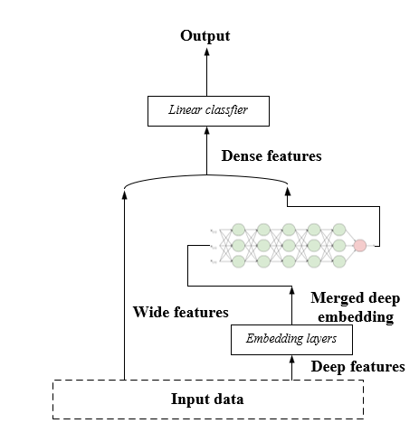

# Deep_CTR_Prediction

## Introduction
In the realm of online advertising, many campaigns operate on a 'pay-per-click' (PPC) model, wherein advertisers only pay when their ads are clicked on, rather than just being viewed. Consequently, for a search engine like ours, the optimal strategy involves selecting ads based on their 'expected value.' This metric is calculated by multiplying the price of a click by the probability that the ad will indeed be clicked. The higher this expected value, the more favorable it is to display the ad. Therefore, to maximize this expected value, it's crucial to accurately predict the likelihood of a particular ad being clicked, commonly referred to as the 'click-through-rate' (CTR).

In this project, I will use several models, mainly divided into matrix factorization based method, tree-based method and deep models, to predict CTR in a dataset.

## Dataset
The dataset is available [here](https://www.kaggle.com/competitions/avazu-ctr-prediction/overview).

## Some key notes from this project

- I applied several models. Gradient boost, factorization machine, wide and deep, DeepFM.
  
- About factorization machine: sometimes we should utilize feature-pair information. Factorization Machines takes inspiration from matrix factorization, and models the feature interaction using latent factors. Every feature has a corresponding latent factor, and two features' interactions are modelled by ⟨⋅,⋅⟩, where ⟨⋅,⋅⟩ refers to the dot product of the two feature vector. We can set the size of vector as k.
  
- About Wide & Deep: Some general guides about choosing wide and deep features: wide features - Categorical features with a limited number of unique values, numerical features, and interactions between features (e.g., feature crosses); deep features - High-cardinality categorical features, text data, and other features that can benefit from being transformed into dense representations. The wide component is a generalized linear model. The deep component is a feed-forward neural network.
  
- The first problem is very tricky. According to the original dataset description, some variables are anonymized categorical but is represented in a int64 type. At first when I applied wide & Deep model, I tend to first convert all columns (except target column) into object type then do the rest steps. But in the end, AUC score is pretty much the same as gradient boost machine, sometimes even worse. But when I directly use the original data type, did label encoding for all the categorical type and one-hot encoding for the shallow features (cardinality<=100) as **wide features**, manually select some high-cardinality categorical features as **deep features**, it turned out to be better.

- It's another point that I want to write down here, I didn't use all the non-shallow features as deep features. This may lead to some cross-features not used in the end. But I actually checked a lot of resources and found that there were a lot of flexibilities and variations here [exmaple 1](https://wngaw.github.io/wide-and-deep-learning/),[example 2](https://chromium.googlesource.com/external/github.com/tensorflow/tensorflow/+/r0.10/tensorflow/g3doc/tutorials/wide_and_deep/index.md). It's up to you to decide how to select features in the end.
  
- About DeepFM: One imporatant difference between DeepFM and Wide&Deep is there is no need for expertise feature engineering (like manually create interactions between features) on the input. DeepFM will utilize the advantages of FM to capture pairwise relations. Also in DeepFM, the FM component and the deep component share the same input.

## Conclusion

- Conducted an extensively interactive component-decomposed visualization analysis on a 10GB+ advertisement data after
ETL; developed baseline tree-based and feature-pair aware matrix factorization model for highly mixed type dataset.
- Introduced DeepFM models to automatically grasp feature correlation after type-based column segamentation and sparse/
dense representation; enhanced performance by optimizing ROI in PPC campaigns with 3% increase in AUC.
- Implemented a Wide & Deep hybrid model with feature reduction and cross-feature generation; applied customized en-
coding techniques for cardinality-varying features, achieving an additional 3% increase in AUC.

## Reference

Wide & Deep: [link](https://arxiv.org/pdf/1606.07792)

DeepFM: [link](https://arxiv.org/pdf/1703.04247)
